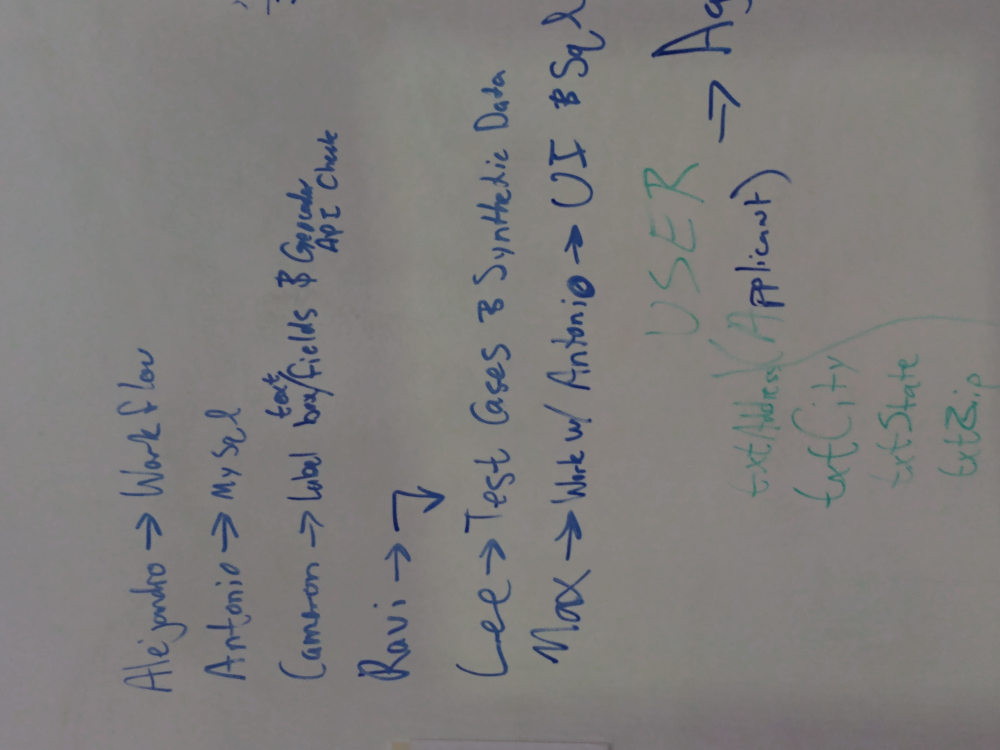
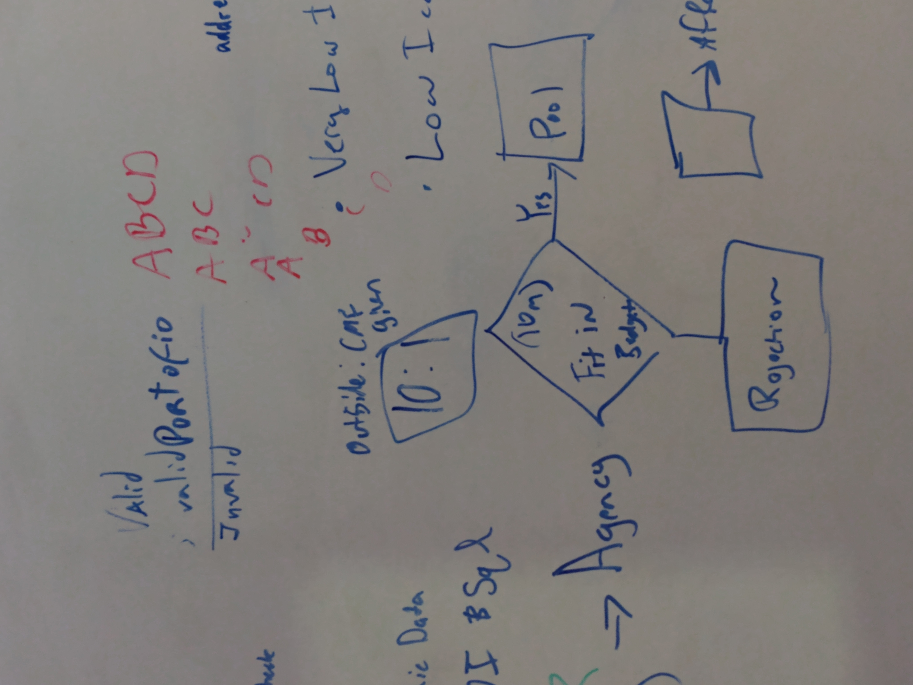
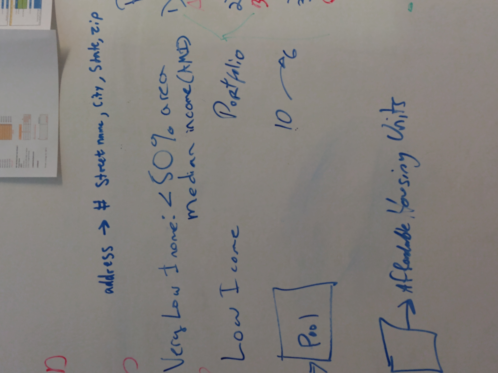
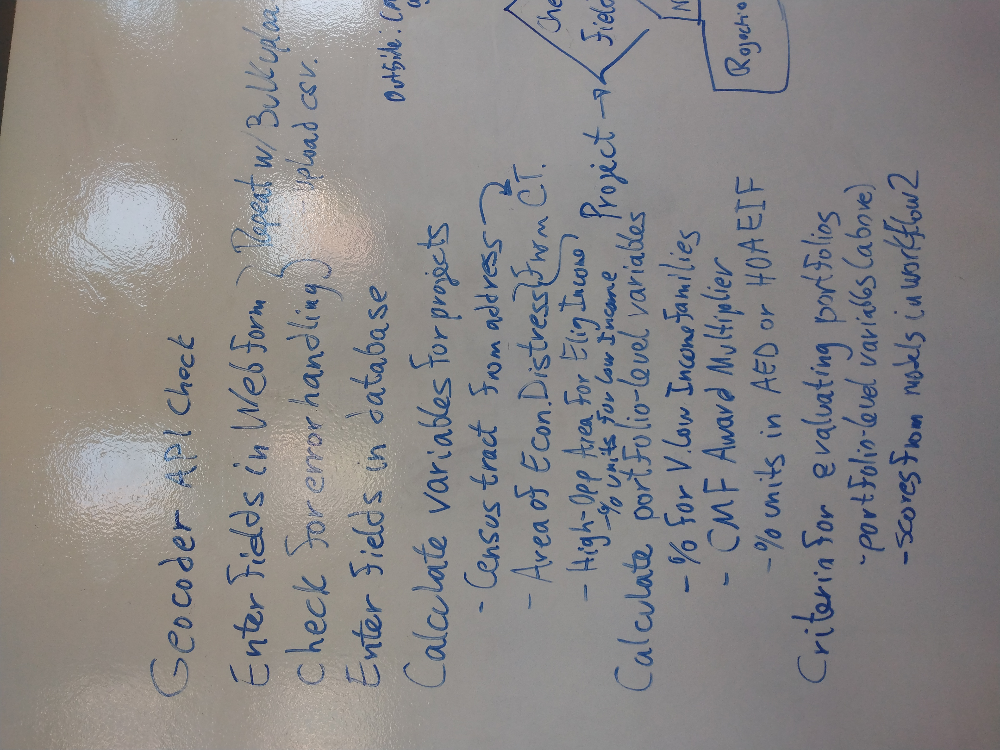
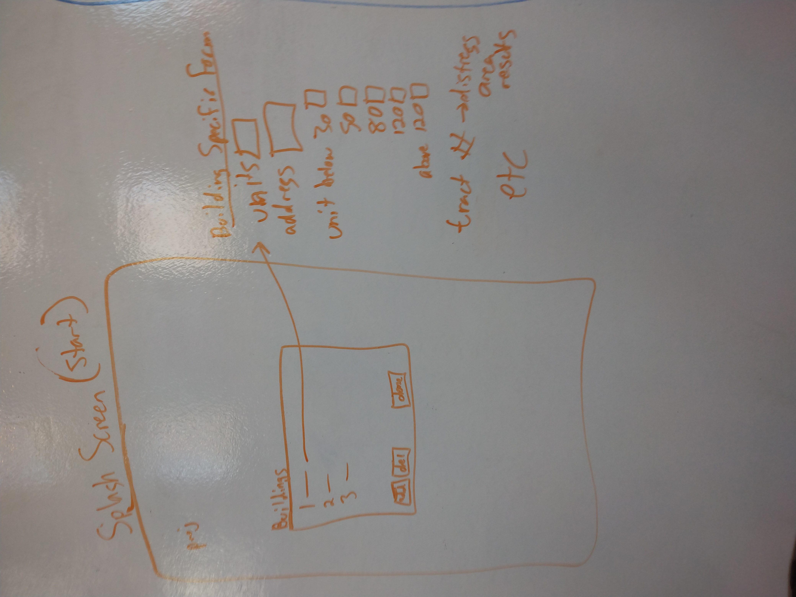
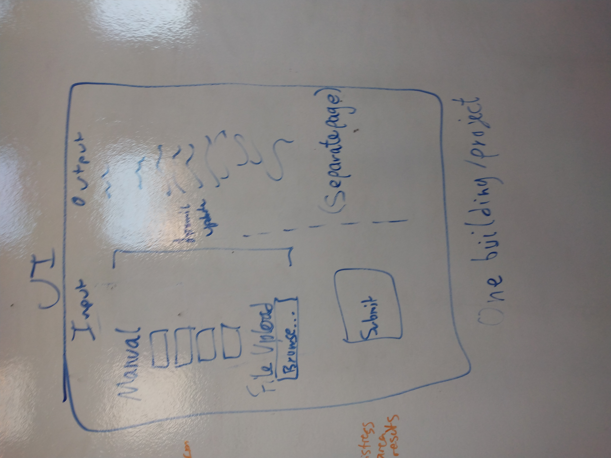

# Definitions of Fields in the Web Form

## Property Identification

- ```txtPPN```	is the name of the proposed project. 
  It must be a string without spaces nor special characters.

- ```txtAddr1```	is the first line of the address of the proposed building. 
  It must be a nonempty string. 

- ```txtAddr2```	is the second line of the address of the proposed building. 
  It must be a string but could be empty. 

- ```txtCity```	is the city in which the proposed building is located. 
  It must be a nonempty string. 

- ```txtState```	is the acronym for the state in which the proposed building is located. 
  It must be a nonempty string comprising two upper-case letters, which could be defined by a drop-down menu. 

- ```txtZIP```	is the ZIP code in which the proposed building is located. 
  It must be a positive integer five digits long
  and, preferably, a valid ZIP code. 


## Financing information


- ```txtTotProjCost```	is the total projected cost of the building project. 
  It must be a positive integer. 

- ```txtNoCmfClf```		is the amount of financing for the project
obtained from the Florida Community Loan Fund (FCLF),
from sources other than the Capital Magnet Fund (CMF) for which this application is filed. 
  It must be a positive integer less than ```txtTotProjCost```. 

- ```txtPrivCash```		is the amount of financing for the project
obtained from other private sources of financing. 
  It must be a positive integer less than ```txtTotProjCost```.

- ```txtGovCash```		is the amount of financing for the project
obtained from government sources other than
the Florida Community Loan Fund (FCLF)
and the Capital Magnet Fund (CMF) for which this application is filed. 
  It must be a positive integer less than ```txtTotProjCost```. 

- ```txtCMFLoan```		is the remaining amount of financing for the project obtained from the Capital Magnet Fund (CMF) 
for which this application is filed. 
  It must be a positive integer less than ```txtTotProjCost```.
  
Furthermore, the sum of 
  ```txtNoCmfClf```, ```txtPrivCash```, ```txtGovCash```, 
  and ```txtCMFLoan``` must equal ```txtTotProjCost```.


## Inventory of Units


- ```txtUnitCount```	is the total number of housing units in the proposed housing development. 
  It must be a positive integer. 

- ```txtUnder30```	is the total number of housing units in the proposed housing development 
that will be rented to families with incomes 
below 30 percent of the Area Median Income (AMI). 
  It must be a positive integer less than 
  or equal to ```txtUnitCount```. 

- ```txtUnder50```	is the total number of housing units in the proposed housing development 
that will be rented to families with incomes 
between 30 percent and 50 percent of the AMI. 
  It must be a positive integer less than 
  or equal to ```txtUnitCount```. 

- ```txtUnder60```		is the total number of housing units in the proposed housing development 
that will be rented to families with incomes 
between 50 percent and 60 percent of the AMI. 
  It must be a positive integer less than 
  or equal to ```txtUnitCount```. 

- ```txtUnder80```		is the total number of housing units in the proposed housing development 
that will be rented to families with incomes 
between 60 percent and 80 percent of the AMI. 
  It must be a positive integer less than 
  or equal to ```txtUnitCount```. 

- ```txtUnder120```		is the total number of housing units in the proposed housing development 
that will be rented to families with incomes 
between 80 percent and 120 percent of the AMI. 
  It must be a positive integer less than 
  or equal to ```txtUnitCount```. 

- ```txtAbove120``` 	is the total number of housing units in the proposed housing development 
that will be rented to families with incomes 
above 120 percent of the AMI. 
  It must be a positive integer less than 
  or equal to ```txtUnitCount```. 

Furthermore, the sum of 
  ```txtUnder30```, ```txtUnder50```, ```txtUnder60```, 
  ```txtUnder80```, ```txtUnder120```, 
  and ```txtAbove120``` must equal ```txtUnitCount```.


# Methods of Data Entry

## Current Procedure

1. Enter the fields from the pdf application form 
into the project template worksheet.
1. Copy the project worksheet into the CMF spreadsheet. 
1. Calculate the criteria for valid data entry
and verify said conditions for valid data entry.
a. Verify that the sum of financing sources 
```txtNoCmfClf```, ```txtPrivCash```, ```txtGovCash```, 
  and ```txtCMFLoan``` 
  is equal to the total project cost, ```txtTotProjCost```.
a. Verify that the sum of the sum of the 
allocation of housing units to the income categories
  ```txtUnder30```, ```txtUnder50```, ```txtUnder60```, 
  ```txtUnder80```, ```txtUnder120```, 
  and ```txtAbove120``` equals ```txtUnitCount```.
1. Calculate the criteria for project eligibility
and verify said conditions for eligibility. 
1. Perform a search for the Census Tract Identifier
from the address at which the proposed development is to be constructed. 
1. Perform a search to determine whether the 
Census Tract Identifier is linked to 
a location designated as an 
Area of Economic Distress. 
1. Perform a search to determine whether the 
Census Tract Identifier is linked to 
a location designated as a
High-Opportunity Area for Eligible-Income Families. 
1. Verify that, if the project were approved, 
  the characteristics of the project must not
  cause the portfolio of grants to violate any of the
  conditions in
  "Constraints on the Portfolio of Grants Allocated", 
  listed below. 
1. If the project and the portfolio passes all
eligibility criteria and constraints, 
the financial officer may select this project 
for allocation of a CMF grant. 
1. If the project is approved, update the characteristics
of the portfolio of grants to include the newly approved project. 


## Proposed Procedure for Entry of Grant Applications
  
### Web Form

This method is intended to be used to enter 
project information from one funding application
for a single development project.
During phase-in period, the data could be copied manually
from the pdf forms submitted as applications for grants. 
This is still a manual process but it avoids
copying project parameters and avoids the manual calculation 
of data validity conditions, eligibility criteria, 
and portfolio constraints, 
as well as any manual data collection that is required for
such calculations. 

In production, the web form could also be hosted on the public webpage of either the city or the
local granting agency so that applicants
can enter the data for their own development proposal. 
The advantage of the live version is that potential applicants
will immediately notice data entry errors
and will be alerted to violations of eligibility constraints before submission. 
This will provide value in that applicants will avoid delays
or lost investment opportunities
during the wait for a denial that results from 
violations of eligibility criteria  
or conditions for valid data entry.
Furthermore, once an application meets the initial screening criteria, 
the application will immediately
be loaded into the database for consideration by 
the financing officer. 


1. The user enters the project parameters into the text boxes
in the web form. 
1. After each field is completed, once the user moves to the next field, 
the data validity conditions are checked.
Then, all data checks and eligibility checks are updated
for the project and these results appear in 
a summary that is displayed in the 
right pane of the web form. 
1. When the form is complete, the user clicks "Submit", 
and the fields from the web form 
are loaded as a new record in the project database.


### Bulk Upload

This procedure is intended to be used for batch uploads of 
several applications at once.
It can also be used to initialize a database with
the current portfolio of both approved projects, 
rejected projects, and projects eligible for a decision. 

1. Enter project parameters into columns of a spreadsheet
in csv format, with each row representing a separate project.
1. Choose the "Bulk Upload" option.
1. A dialogue box appears with a "Browse" button
for the user to browse to the location containing 
the csv file for bulk upload. 
1. After the user presses "Submit",
the projects will be loaded into the database
one at a time, checked for validity of data entry, 
and inserted as new records in the database of projects. 


# Constraints on Grant Allocation

## Conditions for Eligibility of Individual Projects

To be eligible for funding from the Capital Magnet Fund (CMF), 
the project must satisfy the following conditions:
  
  1. Twenty percent of affordable housing units in the proposed development project must be designated for rentals for Low Income Families.
That is, the sum of ```txtUnder30``` and ```txtUnder50```
must comprise at least 20 percent 
of the number of units in ```txtUnitCount```.


## Constraints on the Portfolio of Grants Allocated

At the time of an allocation of a CMF grant to a project, 
the portfolio of loans must satisfy the following conditions.

1. Forty-five percent of rental affordable housing units
must be designated for rental to families 
in the "Very Low Income" category. 
That is, the sum of ```txtUnder30``` and ```txtUnder50```
across all projects in the portfolio
must be more than 45 percent of the sum of ```txtUnitCount```
across all projects in the portfolio. 

1. The sum of the *total project cost* 
aggregated across all projects in the portfolio
must be ten times the sum of the CMF awards across the portfolio. 
For example, an award of one million dollars in CMF funding
would be the maximum funding permissible
for a portfolio for which the sum of the 
total project cost adds to ten million dollars.
*Note that the constraint on this multiplier is based on total project cost, which includes funds from state or local governments, even though the CMF tool calculates a multiplier that is the ratio of private funding to CMF funding, which is also a useful metric.*

1. Sixty percent of rental affordable housing units 
must be located in either Areas of Economic Distress or High-Opportunity Areas for Eligible-Income Families. 
That is, the sum of ```txtUnitCount```
aggregated across all projects in the portfolio 
must be located in Census Tract Areas that are designated
as either Areas of Economic Distress or High-Opportunity Areas for Eligible-Income Families. 


# Images of the Whiteboard

Just in case the clean-up crew visits on Saturday night.

Original allocation of tasks:



Flow chart of applications (sketch):



Note that the order of operations was later modified, 
since data validity and eligibility criteria 
are checked first, 
before projects are added to the set of 
eligible projects. 
In the next stage, 
provided the projects are within budget, 
the financial officer would 
rank the projects and approve projects for CMF grants.


Definition of "Very Low Income":



Conditions for eligibility of projects
and overall constraints on portfolio of grants:


Initial list of fields in test cases and web form:


Sketch of UI for grant applications:


Note that this preliminary version only covers
projects with a single building. 
A proposal for features that would handle multi-building
projects is detailed below. 
Also, the preliminary version of the web form
performs calculations after the user submits the page, 
which then redirects to a summary page with the calculated
metrics and eligibility criteria. 
Later version can perform data checks and eligibility checks
live, as soon as the individual fields are entered, 
so that the applicant immediately sees that the 
data validity and eligibility criteria are satisfied. 


To-do list for day 2:



Proposal for added feature: add functionality for multi-building projects. Application starts at a splash page
on which applicant enters project information, 
including the sources of financing. 



This page includes a button to add or delete buildings. 
For an added building, the applicant clicks a button to 
complete the information sheet for each building, which is the simpler version prototyped above. 
For each building, the applicant enters the address, 
which is used to look up the status as an 
Area of Economic Distress, which may be different for buildings bordering a Census tract. 
The main data entry task on this page is the distribution 
of units across the designations of rental to families within
the income categories. 




Once the applicant completes the page for the building, 
and presses the "Submit" button,
the data-entry checks are performed on this page 
and the total counts of units are accumulated in a panel
back on the splash page covering the entire project. 


## Next Steps

Some of these items were completed but some remain
as a sketch of the strategy for building out these features. 
Proposals are documented in the README files 
in various folders within this repository. 
Progress and remaining questions are also documented
in the Activity table within the 
[google doc for the project brief](https://docs.google.com/document/d/1FWQMIgPJqb0235BIkKMO6CU1JqtRGN7CnQolky6jmOo/edit).
