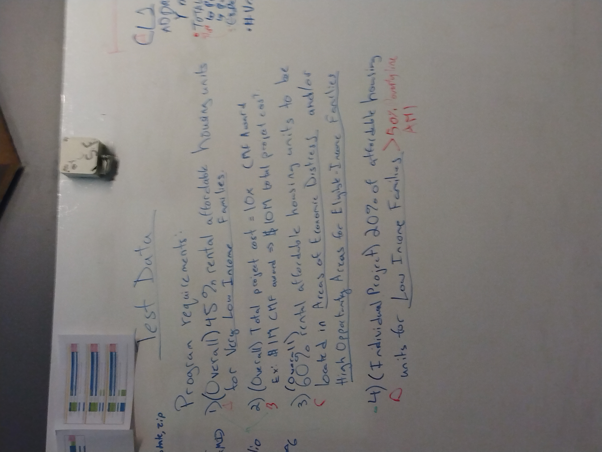
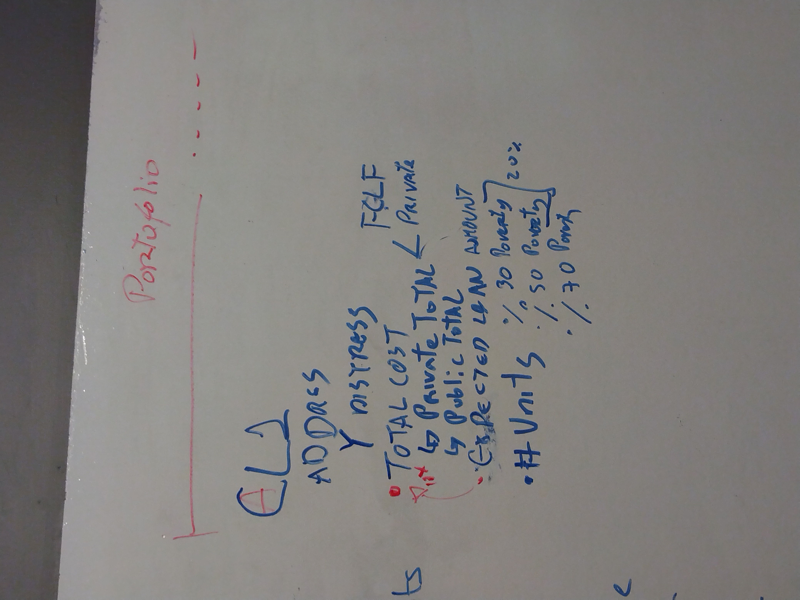

# Definitions of Fields in the Web Form

## Property Identification

- ```txtPPN```	is the name of the proposed project. 
  It must be a string without spaces nor special characters.

- ```txtAddr1```	is the first line of the address of the proposed building. 
  It must be a nonempty string. 

```txtAddr2```	is the second line of the address of the proposed building. 
  It must be a string but could be empty. 

```txtCity```	is the city in which the proposed building is located. 
  It must be a nonempty string. 

```txtState```	is the acronym for the state in which the proposed building is located. 
  It must be a nonempty string comprising two upper-case letters, which could be defined by a drop-down menu. 

```txtZIP```	is the ZIP code in which the proposed building is located. 
  It must be a positive integer five digits long
  and, preferably, a valid ZIP code. 


## Financing information


```txtTotProjCost```	is the total projected cost of the building project. 
  It must be a positive integer. 

```txtNoCmfClf```		is the amount of financing for the project
obtained from the Florida Community Loan Fund (FCLF),
from sources other than the Capital Magnet Fund (CMF) for which this application is filed. 
  It must be a positive integer less than ```txtTotProjCost```. 

```txtPrivCash```		is the amount of financing for the project
obtained from other private sources of financing. 
  It must be a positive integer less than ```txtTotProjCost```.

```txtGovCash```		is the amount of financing for the project
obtained from government sources other than
the Florida Community Loan Fund (FCLF)
and the Capital Magnet Fund (CMF) for which this application is filed. 
  It must be a positive integer less than ```txtTotProjCost```. 

```txtCMFLoan```		is the remaining amount of financing for the project obtained from the Capital Magnet Fund (CMF) 
for which this application is filed. 
  It must be a positive integer less than ```txtTotProjCost```.
  Furthermore, the sum of 
  ```txtNoCmfClf```, ```txtPrivCash```, ```txtGovCash```, 
  and ```txtCMFLoan``` must equal ```txtTotProjCost```.


## Inventory of Units


```txtUnitCount```	is the total number of housing units in the proposed housing development. 
  It must be a positive integer. 

```txtUnder30```	is the total number of housing units in the proposed housing development 
that will be rented to families with incomes 
below 30 percent of the Area Median Income (AMI). 
  It must be a positive integer less than ```txtUnitCount```. 

```txtUnder50```	is the total number of housing units in the proposed housing development 
that will be rented to families with incomes 
between 30 percent and 50 percent of the AMI. 
  It must be a positive integer less than ```txtUnitCount```. 

```txtUnder60```		is the total number of housing units in the proposed housing development 
that will be rented to families with incomes 
between 50 percent and 60 percent of the AMI. 
  It must be a positive integer less than ```txtUnitCount```. 

```txtUnder80```		is the total number of housing units in the proposed housing development 
that will be rented to families with incomes 
between 60 percent and 80 percent of the AMI. 
  It must be a positive integer less than ```txtUnitCount```. 

```txtUnder120```		is the total number of housing units in the proposed housing development 
that will be rented to families with incomes 
between 80 percent and 120 percent of the AMI. 
  It must be a positive integer less than ```txtUnitCount```. 

```txtAbove120``` 	is the total number of housing units in the proposed housing development 
that will be rented to families with incomes 
above 120 percent of the AMI. 
  It must be a positive integer less than ```txtUnitCount```. 

  Furthermore, the sum of 
  ```txtUnder30```, ```txtUnder50```, ```txtUnder60```, 
  ```txtUnder80```, ```txtUnder120```, 
  and ```txtAbove120``` must equal ```txtUnitCount```.


# Constraints on Grant Allocation

## Conditions for Eligibility of Individual Projects

To be eligible for funding from the Capital Magnet Fund (CMF), 
the project must satisfy the following conditions:
  
  1. Twenty percent of affordable housing units in trhe proposed development project must be designated for rentals for Low Income Families.
That is, the sum of ```txtUnder30``` and ```txtUnder50```
must comprise at least 20 percent 
of the number of units in ```txtUnitCount```.


## Constraints on the Portfolio of Grants Allocated

At the time of an allocation of a CMF grant to a project, 
the portfolio of loans must satisfy the following conditions.

1. Forty-five percent of rental affordable housing units
must be designated for rental to families 
in the "Very Low Income" category. 
That is, the sum of ```txtUnder30``` and ```txtUnder50```
across all projects in the portfolio
must be more than 45 percent of the sum of ```txtUnitCount```
across all projects in the portfolio. 

1. The sum of the total project cost 
aggregated across all projects in the portfolio
must be ten times the sum of the CMF awards across the portfolio. 
For example, an award of one million dollars in CMF funding
would be the maximum funding permissible
for a portfolio for which the sum of the 
total project cost adds to ten million dollars.

1. Sixty percent of rental affordable housing units 
must be located in either Areas of Economic Distress or High-Opportunity Areas for Eligible-Income Families. 
That is, the sum of ```txtUnitCount```
aggregated across all projects in the portfolio 
must be located in Census Tract Areas that are designated
as either Areas of Economic Distress or High-Opportunity Areas for Eligible-Income Families. 


# Images of the Whiteboard

Just in case the clean-up crew visits on Saturday night.

Original allocation of tasks:


Flow chart of applications (sketch):


Definition of "Very Low Income":


Conditions for eligibility of projects
and overall constraints on portfolio of grants:



Initial list of fields in test cases and web form:



Sketch of UI for grant applications:


