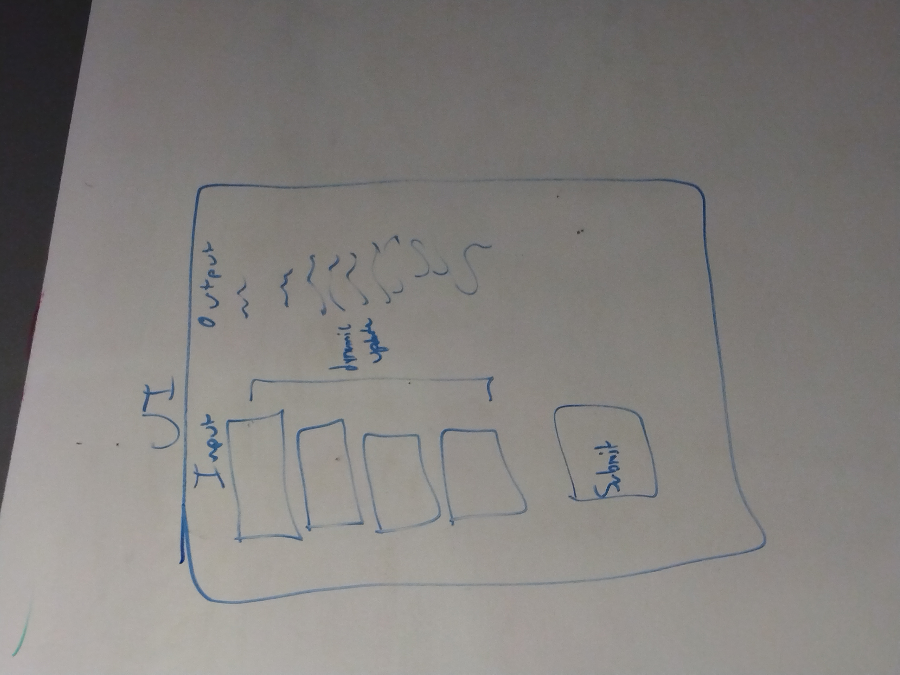

# Definitions of Fields in the Web Form

## Property Identification

```txtPPN```	

```txtAddr1```	

```txtAddr2```	

```txtCity```	

```txtState```	

```txtZIP```	


## Financing information


```txtTotProjCost```	

```txtNoCmfClf```	

```txtPrivCash```	

```txtGovCash```	

```txtCMFLoan```	


## Inventory of Units


```txtUnitCount```	

```txtUnder30```	

```txtUnder50```	

```txtUnder60```	

```txtUnder80```	

```txtUnder120```	

```txtAbove120```


## Images of the Whiteboard

In case the clean-up crew visits on Saturday night:



